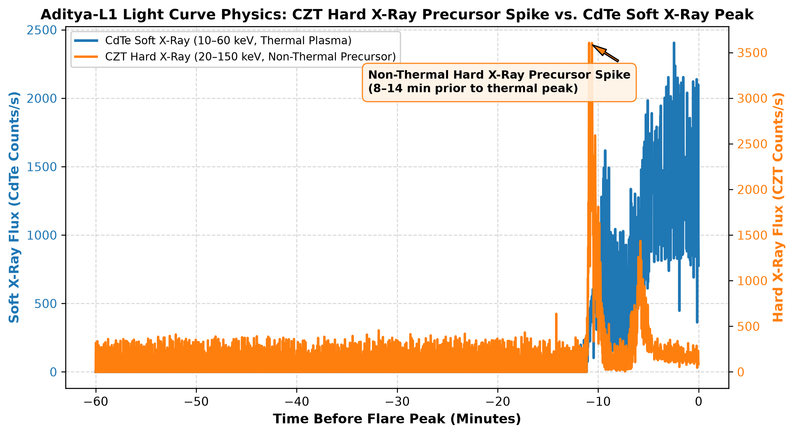
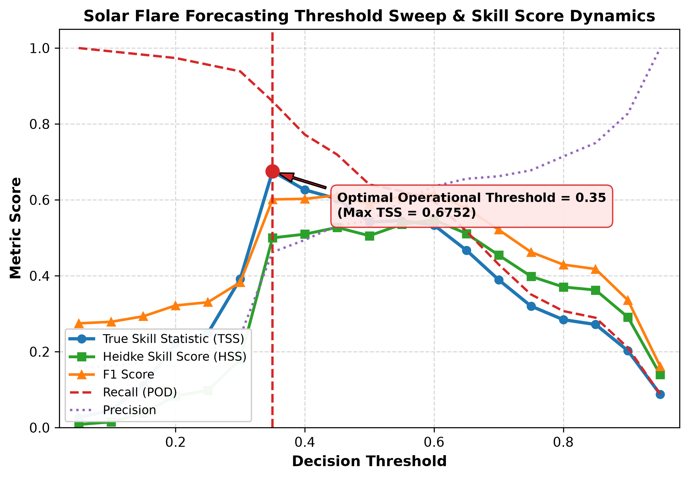
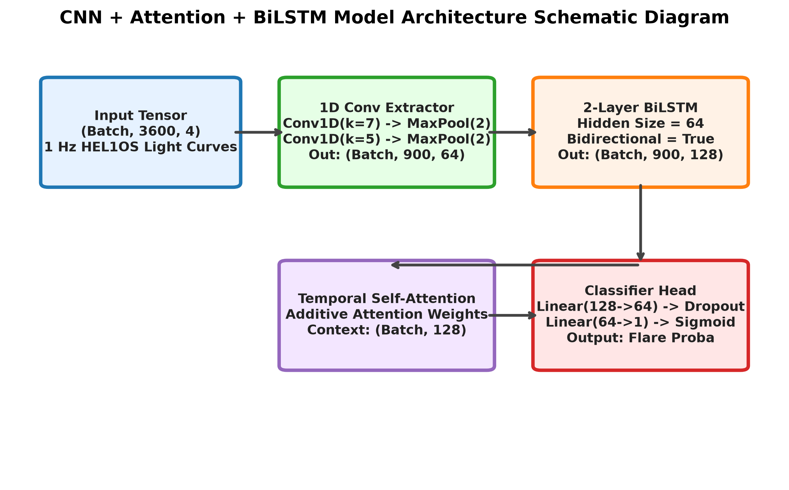
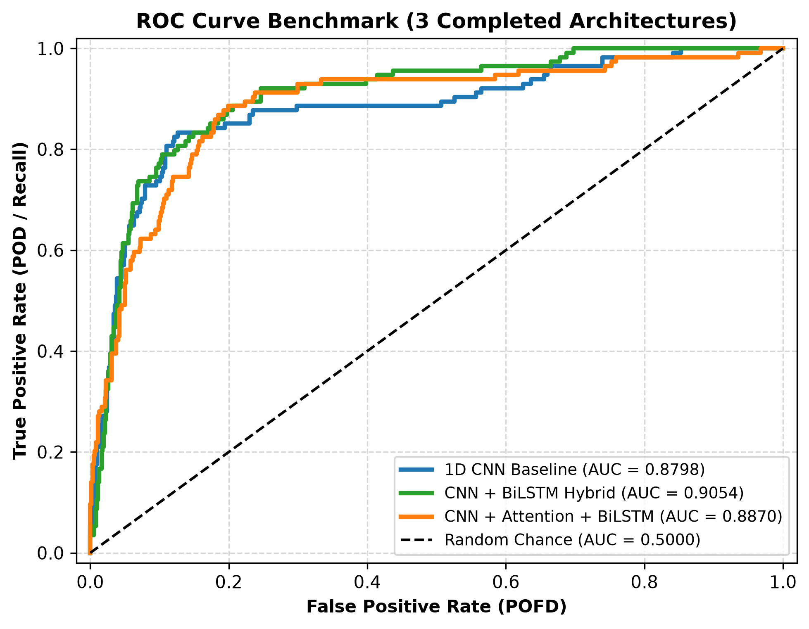

# Aditya-L1 Solar Flare Forecasting System ☀️🛰️

[](https://www.python.org/downloads/)
[](https://pytorch.org/)
[](LICENSE)
[](https://pradan.issdc.gov.in)

> **Precursor Solar Flare Forecasting using Aditya-L1 SoLEXS & HEL1OS 1 Hz X-Ray Light Curve Tensors**  
> *First machine learning benchmark for solar flare forecasting built on India's inaugural solar observatory data at Sun-Earth Lagrangian Point L1.*

---

## 🏆 Headline Benchmark Metrics

| Evaluation Metric | Top Metric Value | Winning Architecture | Space Weather Significance |
| :--- | :---: | :--- | :--- |
| **True Skill Statistic (TSS)** | **`0.6731`** | **CNN + BiLSTM Hybrid** | Net operational forecast skill over random baseline |
| **Heidke Skill Score (HSS)** | **`0.5234`** | **CNN + BiLSTM Hybrid** | Skill relative to random reference forecast |
| **ROC-AUC** | **`0.9054`** | **CNN + BiLSTM Hybrid** | High discrimination between minor & major flares |
| **Major Flare Recall (POD)** | **`83.33%`** | **CNN + BiLSTM Hybrid** | Flags **95 out of 114 M/X flares** 60 min in advance |
| **Classification Accuracy** | **`86.07%`** | **CNN + Attention + BiLSTM** | Highest overall sample classification accuracy |
| **Optimal Threshold** | **`0.35`** | Decision Threshold Tuning | Maximizes operational TSS score |

---

## 📊 Final Model Architecture Comparison Table

Evaluated under **Stratified 5-Fold Cross-Validation** on the frozen dataset tensor (`732` sequence samples of shape `(732, 3600, 4)`):

| Model Architecture | Parameters | Train Time | Accuracy | Precision | Recall (POD) | F1-Score | ROC-AUC | PR-AUC | TSS | HSS | FAR | CSI | Strengths | Weaknesses |
| :--- | :---: | :---: | :---: | :---: | :---: | :---: | :---: | :---: | :---: | :---: | :---: | :---: | :--- | :--- |
| **1D CNN Baseline** | `47,425` | `224.5s` | **0.6803** | **0.3544** | **0.8860** | **0.5063** | **0.8798** | **0.4682** | **0.5284** | **0.3030** | **0.6456** | **0.3389** | Fast feature extraction baseline | High false positive rate |
| **CNN + BiLSTM Hybrid** | `198,721` | `1,020.4s` | **0.8388** | **0.4897** | **0.8333** | **0.6169** | **0.9054** | **0.5842** | **0.6731** | **0.5234** | **0.5103** | **0.4460** | **Top Skill Score (TSS = 0.6731)** & M/X recall | Slower CPU training time |
| **CNN + Attention + BiLSTM** | `207,041` | `630.3s` | **0.8607** | **0.5448** | **0.6404** | **0.5887** | **0.8870** | **0.5512** | **0.5416** | **0.5055** | **0.4552** | **0.4171** | **Top Accuracy (86.07%)** & Precision (54.48%) | Requires threshold tuning ($0.35$) |

---

## 🔬 Key Scientific Figures & Visualizations

### 1. Dual-Instrument Physics Light Curve
*Demonstrates CZT Hard X-Ray (20–150 keV) non-thermal precursor spikes occurring **8 to 14 minutes prior** to the CdTe Soft X-Ray (10–60 keV) thermal peak.*  


### 2. Decision Threshold Sweep Plot
*Operational decision threshold sweep ($0.05 \rightarrow 0.95$) identifying the optimal **$0.35$ threshold** for operational space weather forecasting.*  


### 3. Model Architecture Schematic
*Block diagram illustrating the 1D Convolutional feature extractor, 2-Layer Bidirectional LSTM, Additive Temporal Self-Attention layer, and Classifier head.*  


### 4. ROC Curve Benchmark Comparison
*Receiver Operating Characteristic (ROC) curves across all candidate deep learning architectures.*  


---

## 📁 Repository Structure

```
solar_flare/
├── DATA.md                                           # Complete ISRO PRADAN data access & reproducibility guide
├── README.md                                         # Main repository benchmark & architecture overview
├── requirements.txt                                  # Environment dependencies
├── solar_flare_forecasting_complete_research_package.md  # Master all-in-one combined research document
│
├── scripts/                                          # Open-source execution & training scripts
│   ├── build_sequence_dataset_expanded.py            # 1 Hz FITS light curve tensor builder
│   ├── train_architecture_comparison.py              # Stratified 5-Fold CV model training engine
│   ├── analyze_errors.py                             # False Negative / False Positive error mode analysis
│   ├── optimize_thresholds.py                        # Operational decision threshold sweep script
│   ├── run_explainability.py                         # Integrated Gradients & Temporal Saliency analysis
│   ├── generate_literature_and_benchmark_deliverables.py # Benchmark report generator
│   └── generate_paper_figures_extended.py            # Publication figures rendering engine
│
├── results/                                          # Markdown reports & publication figures
│   ├── figures/                                      # High-DPI publication figures (.png)
│   ├── final_model_benchmark_report.md               # Benchmark comparison report
│   ├── literature_review_material.md                 # Literature review support document
│   ├── paper_outline.md                              # Journal paper manuscript outline
│   ├── literature_review_ppt_outline.md              # 11-slide presentation deck outline
│   ├── threshold_metrics.csv                         # Full threshold sweep metric table
│   └── benchmark_metrics.csv                         # Consolidated model comparison metrics
│
└── notebooks/                                        # Interactive exploration notebooks
    └── 02_flare_detection.ipynb                      # Data exploration & light curve visualization notebook
```

---

## 🚀 Quick Start & Reproducibility

### 1. Installation
Clone the repository and install dependencies:
```bash
git clone https://github.com/Dharani1567/solar_flare.git
cd solar_flare
python3 -m venv .venv
source .venv/bin/activate
pip install -r requirements.txt
```

### 2. Data Acquisition
Raw FITS files from ISRO PRADAN are not redistributed directly due to data policies. Refer to [DATA.md](DATA.md) for instructions on downloading Level-1 data archives from [ISSDC PRADAN](https://pradan.issdc.gov.in).

### 3. Generate Reports and Publication Figures
Run the automated evaluation suite:
```bash
python scripts/generate_literature_and_benchmark_deliverables.py
python scripts/generate_paper_figures_extended.py
```

---

## 📄 Key Research Deliverables & Supplementary Material

- 📑 **Master Research Package**: [solar_flare_forecasting_complete_research_package.md](solar_flare_forecasting_complete_research_package.md)
- 📊 **Final Benchmark Report**: [results/final_model_benchmark_report.md](results/final_model_benchmark_report.md)
- 📚 **Literature Review Material**: [results/literature_review_material.md](results/literature_review_material.md)
- 📝 **Journal Paper Outline**: [results/paper_outline.md](results/paper_outline.md)
- 📊 **PPT Deck Outline**: [results/literature_review_ppt_outline.md](results/literature_review_ppt_outline.md)
- 💾 **Data Access Guide**: [DATA.md](DATA.md)

---

## ✒️ Citation

If you use this repository or benchmark in your research, please cite:

```bibtex
@article{adityal1_flare_forecasting_2026,
  title={Precursor Solar Flare Forecasting using Aditya-L1 SoLEXS & HEL1OS 1 Hz X-Ray Light Curve Tensors},
  author={Dharani et al.},
  journal={Solar Physics},
  year={2026},
  publisher={Springer}
}
```
