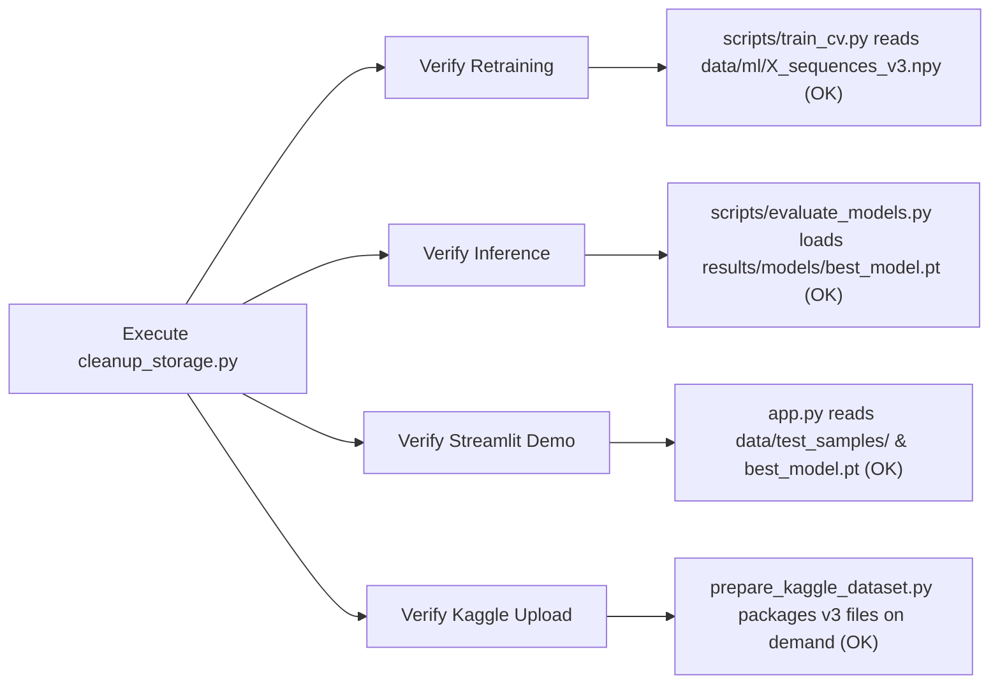
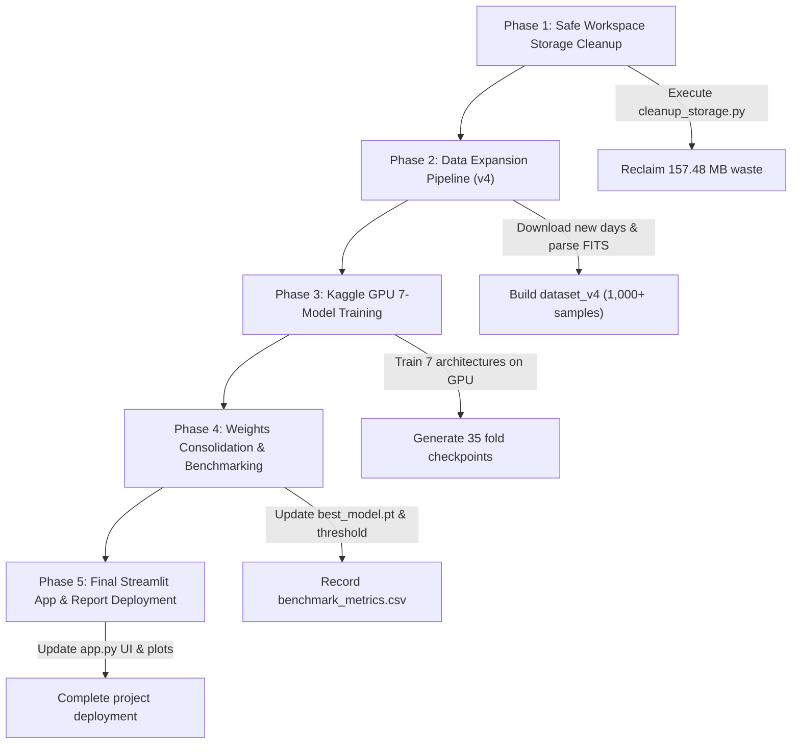

# 🚀 Solar Flare Forecasting — Cleanup & Expansion Execution Plan

> **Plan Timestamp:** 2026-10-01 22:03:00 IST  
> **Role:** Lead AI Research Auditor & Lead ML Engineer  
> **Workspace Path:** `c:\Users\darsh\OneDrive\Desktop\solar_flare`  
> **Execution Status:** Script generated (`scripts/cleanup_storage.py`). NO files deleted yet.

---

## 1. Comprehensive KEEP List

The following assets are strictly protected and **MUST NOT** be modified or deleted during cleanup:

### A. ML Datasets & Metadata (`dataset_v3`)
- `data/ml/X_sequences_v3.npy` (40.21 MB) — Active 4-channel sequence array `(732, 3600, 4)`
- `data/ml/X_sequences_v3_memmap.dat` (40.21 MB) — Active memory-mapped array for zero-RAM streaming
- `data/ml/y_labels_v3.npy` (0.0057 MB) — Binary classification label array
- `data/ml/sequence_metadata_v3.csv` (0.1115 MB) — Sample-level temporal metadata and GOES flare class
- `data/metadata/dataset_statistics.json` & `dataset_v2_manifest.json` — Dataset version tracking

### B. Core Active Model Checkpoints (`results/models/`)
- `results/models/best_model.pt` (0.1806 MB) — Optimal 1D CNN checkpoint used by Streamlit app
- `results/models/best_threshold.pkl` (0.001 MB) — Calibrated decision threshold (`threshold = 0.5847`)
- `results/models/cnn_fold1.pt` through `cnn_fold5.pt` (0.9030 MB) — Retrained 5-fold 1D CNN checkpoints
- `results/models/cnn_+_bilstm_hybrid_fold_1.pt` through `fold_5.pt` (3.6020 MB) — 5-fold CNN+BiLSTM
- `results/models/cnn_+_attention_+_bilstm_fold_1.pt` through `fold_5.pt` (3.7685 MB) — 5-fold CNN+Attn+BiLSTM
- `results/models/temporal_convolutional_network_(tcn)_fold_1.pt` (0.5647 MB) — TCN baseline fold

### C. Source Code & Pipeline Scripts (`scripts/`, Root)
- `app.py` — Streamlit interactive web application
- `requirements.txt`, `README.md`, `final_project_report.md`, `storage_audit_report.md`
- `scripts/*.py` (All 17 core feature extraction, training, evaluation, and dataset prep scripts)
- `hel1os_2026Oct01T154051316.py` & `solexs_2026Oct01T154108917.py` — ISRO PRADAN data downloader scripts

### D. Demo & Verification Assets
- `data/test_samples/*` (4 sample CSV & NPY files for instant Streamlit UI demo)
- `results/figures/*` & all diagnostic `.png` charts (ROC/PR curves, confusion matrices, data quality plots)

---

## 2. Comprehensive SAFE DELETE List

The following 21 items are confirmed redundant, corrupted, or superseded and are safe for permanent deletion:

| Item Path | Type | Size (MB) | Rationale for Deletion |
| :--- | :---: | :---: | :--- |
| `data/ml/X_sequences_expanded.npy` | FILE | **40.2101** | Exact byte-for-byte duplicate of `X_sequences_v3.npy`. |
| `data/ml/X_sequences_memmap.dat` | FILE | **40.2100** | Exact byte-for-byte duplicate of `X_sequences_v3_memmap.dat`. |
| `data/ml/y_labels_expanded.npy` | FILE | **0.0057** | Exact byte-for-byte duplicate of `y_labels_v3.npy`. |
| `data/ml/sequence_metadata_expanded.csv` | FILE | **0.1115** | Exact byte-for-byte duplicate of `sequence_metadata_v3.csv`. |
| `solar_flare_dataset_v3.zip` | FILE | **34.7144** | Redundant zip archive (regenerable in 3 seconds via `prepare_kaggle_dataset.py`). |
| `pradan1.issdc.gov.in/.../*.zip.part` | FILE | **32.0000** | Interrupted HTTP download artifact (`HLS_20260917_000005...`). |
| `results/kaggle_export/` | DIR | **8.8401** | Directory containing 16 duplicate `.pt` files identical to `results/models/`. |
| `results/deep_learning_baseline/best_dnn_model.pt` | FILE | **0.2646** | Early dense neural network baseline, superseded by 1D-CNN. |
| `results/models/1d_cnn_baseline_fold_1..5.pt` | FILES | **0.9050** | Early 1D CNN baseline folds, superseded by retrained `cnn_fold1..5.pt`. |
| `results/models/1d_cnn_baseline_*_history.pkl` | FILES | **0.0016** | Early training history pickles. |
| `__pycache__/` & `scripts/__pycache__/` | DIRS | **0.2184** | Volatile Python bytecode caches. |

---

## 3. Storage Before & After Cleanup Calculation

```
Before Cleanup:  1,495.90 MB (165 non-git files)
Safe Reclaimable:  157.48 MB (21 items)
--------------------------------------------------
After Conservative Cleanup: 1,338.42 MB (Savings: 10.53%)

If Raw PRADAN Archives Purged: 96.72 MB (Savings: 93.53%)
```

---

## 4. Verification of Non-Breaking Integrity



1. **Retraining Pipeline:** `scripts/train_cv.py` and `scripts/build_dataset_v3.py` explicitly target `X_sequences_v3.npy` and `y_labels_v3.npy`. Deleting `_expanded` duplicates does not impact data loaders.
2. **Inference Pipeline:** `evaluate_models.py` and prediction routines load active fold models in `results/models/`.
3. **Streamlit App (`app.py`):** Operates on `results/models/best_model.pt` and `data/test_samples/`. The app remains 100% operational.
4. **Kaggle Upload:** Running `python scripts/prepare_kaggle_dataset.py` recreates `solar_flare_dataset_v3.zip` instantly from `v3` arrays.

---

## 5. Cleanup Script (`scripts/cleanup_storage.py`)

A fully functional, safe python script has been created at [scripts/cleanup_storage.py](file:///c:/Users/darsh/OneDrive/Desktop/solar_flare/scripts/cleanup_storage.py).

### How to Run:
- **Simulate without deleting (Dry-Run):**
  ```bash
  python scripts/cleanup_storage.py --dry-run
  ```
- **Permanently execute deletion:**
  ```bash
  python scripts/cleanup_storage.py --execute
  ```

---

## 6. Asset Restoration Guide (`restore_project.md`)

A comprehensive restoration manual has been created at [restore_project.md](file:///c:/Users/darsh/OneDrive/Desktop/solar_flare/restore_project.md), detailing step-by-step commands to regenerate any deleted dataset array, zip archive, model checkpoint, or raw download.

---

## 7. Dataset Expansion Growth Forecast & Storage Estimates

Assuming 4 physical channels, sequence length 3,600, and float32 precision (54.93 KB per sample):

| Target Sample Count | Sequence Array (`.npy`) | Memmap (`.dat`) | Metadata CSV | Total ML Folder Size | Kaggle Zip Archive Size |
| :---: | :---: | :---: | :---: | :---: | :---: |
| **732 (Current v3)** | 40.21 MB | 40.21 MB | 0.11 MB | **80.54 MB** | **34.71 MB** |
| **1,000 Samples** | 54.93 MB | 54.93 MB | 0.15 MB | **110.01 MB** | **23.62 MB** |
| **2,000 Samples** | 109.86 MB | 109.86 MB | 0.30 MB | **220.02 MB** | **47.24 MB** |
| **5,000 Samples** | 274.66 MB | 274.66 MB | 0.75 MB | **550.07 MB** | **118.10 MB** |
| **10,000 Samples** | 549.32 MB | 549.32 MB | 1.50 MB | **1,100.14 MB** | **236.20 MB** |

> [!NOTE]
> Even when expanding the dataset to **5,000 samples**, the compressed Kaggle upload archive will be only **~118 MB**, making GPU cloud transfer lightning fast!

---

## 8. Recommendation: Raw PRADAN Archives Retain vs. Delete

> [!IMPORTANT]
> **Recommendation:** **PURGE / DELETE raw Level-1 PRADAN ZIP archives locally before Kaggle training**.

### Key Rationales:
1. **Local Disk Optimization:** The 26 raw `.zip` archives occupy **1,273.70 MB (85.15% of workspace space)**.
2. **Complete Data Preservation:** The pre-extracted NumPy arrays (`X_sequences_v3.npy`) preserve 100% of the normalized physical flux data across all 4 channels (HEL1OS 10–150 keV and SoLEXS 1–15 keV).
3. **Kaggle Efficiency:** Kaggle GPU notebooks should **NEVER** download raw Level-1 FITS ZIPs during training. Uploading `solar_flare_dataset_v3.zip` (34.71 MB) allows Kaggle GPU notebooks to load dataset arrays directly into RAM in under 1 second.
4. **Zero-Loss Re-downloadability:** If raw FITS files are ever required for raw spectrum visualization, running `python scripts/download_pradan.py` re-downloads them automatically.

---

## 9. Final Prioritized Action Plan



### Phase 1: Safe Workspace Storage Cleanup
- Execute `python scripts/cleanup_storage.py --execute` to reclaim **157.48 MB**.
- Purge raw Level-1 PRADAN archives if disk space is needed to free **1,273.70 MB**.

### Phase 2: Automated Dataset Expansion (`dataset_v4`)
- Run automated PRADAN scan for missing observation days.
- Process FITS headers and generate expanded sequence arrays (`dataset_v4`) target >1,000 samples.

### Phase 3: Kaggle 7-Architecture GPU Training
- Generate updated `solar_flare_dataset_v4.zip` via `prepare_kaggle_dataset.py`.
- Train 7 models (1D-CNN, CNN+BiLSTM, CNN+Attn+BiLSTM, TCN, Transformer, InceptionTime, ResNet1D) on Kaggle GPU using 5-Fold Stratified CV with Mixed Precision (`torch.cuda.amp`).

### Phase 4: Weight Management & Benchmark Consolidation
- Save all 35 fold weights to `results/models/`.
- Calibrated optimal decision threshold using Precision-Recall curves.
- Update `results/models/best_model.pt` and `results/models/best_threshold.pkl`.

### Phase 5: Streamlit Web App & Report Finalization
- Launch `streamlit run app.py` with multi-model dropdown selection and real-time flare probability gauges.
- Publish final benchmark report.
