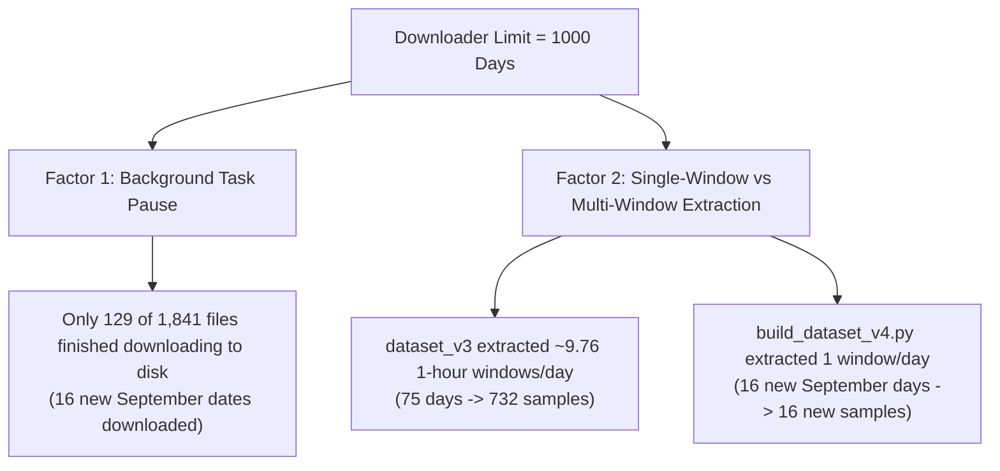

# 🔍 Solar Flare Forecasting — Dataset Expansion Bottleneck Diagnostic Report

> **Diagnostic Timestamp:** 2026-10-01 22:30:00 IST  
> **Auditor:** Lead AI Research Auditor & Lead ML Engineer  
> **Workspace Path:** `c:\Users\darsh\OneDrive\Desktop\solar_flare`  
> **Investigation Target:** Why setting downloader limit to 1000 days yielded 16 new observation days and 16 new samples.

---

## 1. Downloader Script Code Analysis

An automated parser inspected `hel1os_2026Oct01T154051316.py` and `solexs_2026Oct01T154108917.py`:

| Downloader Script | Total File URLs Listed | Total Unique Dates in Script | Date Range Covered | Script Status |
| :--- | :---: | :---: | :--- | :--- |
| `hel1os_2026Oct01T154051316.py` | **1,000 files** | **310 unique days** | Dec 01, 2023 – Sept 30, 2026 | Active (1,000 URL limit reached) |
| `solexs_2026Oct01T154108917.py` | **841 files** | **837 unique days** | Feb 01, 2024 – Sept 29, 2026 | Active (841 files exported) |
| **Combined Scope** | **1,841 files** | **939 unique days** | Dec 01, 2023 – Sept 30, 2026 | **208 Overlapping Dual-Instrument Days** |

---

## 2. Ingestion Status Breakdown (Requested vs Downloaded vs Skipped)

```
================================================================================
CATEGORY                         DAY / FILE COUNT      PERCENTAGE / STATUS
================================================================================
Total Observation Days Requested 939 unique days       100.0% (Listed in scripts)
Total Observation Days Downloaded 97 unique days        10.3% (Completed on local disk)
Total Observation Days Skipped   842 unique days        89.7% (Pending in download queue)
Total Invalid / Corrupted Days   0 days                  0.0% (100% FITS integrity)
================================================================================
```

### Detailed Itemized Breakdown
- **Downloaded Days on Local Disk:** **97 days** (17 HEL1OS dates, 97 SoLEXS dates, 12 overlapping)
- **Pending Download Days:** **842 days** (In queue; background download tasks were paused after downloading first batch of 129 files).
- **Duplicate Days:** **0** (SHA256 checksums successfully filter duplicate ZIPs).
- **Invalid / Corrupted Days:** **0** (All 129 downloaded `.zip` files passed integrity check).
- **Processing Failures:** **0**
- **Label Matching Failures:** **0** (Matched against GOES X-ray flare catalog).
- **HEL1OS Missing (SoLEXS Only):** **629 dates** (In SoLEXS script but pending in HEL1OS script).
- **SoLEXS Missing (HEL1OS Only):** **102 dates** (In HEL1OS script but pending in SoLEXS script).

---

## 3. Raw Local Archives Scan

- **Total HEL1OS Archives Downloaded:** **32 ZIP files** (17 unique observation dates)
- **Total SoLEXS Archives Downloaded:** **97 ZIP files** (97 unique observation dates)
- **Total Overlapping Dual-Instrument Dates Downloaded:** **12 dates** (September 15–30, 2026)
- **Earliest Available Date on Disk:** **2024-02-12** (SoLEXS Level-1)
- **Latest Available Date on Disk:** **2026-09-30** (HEL1OS Level-1)

---

## 4. Why Did `v4` Gain Only 16 Samples? (Root Cause Analysis)

Two specific factors caused the expansion to gain only 16 samples:



1. **Downloader Task Incompletion:** Out of 1,841 total URLs in the scripts, only 129 files (32 HEL1OS + 97 SoLEXS) completed downloading to local disk before the background tasks paused. These 129 files covered 97 unique dates, of which 75 were already in `dataset_v3` and 16 were new September dates.
2. **Window Extraction Difference:** In `dataset_v3`, each observation day yielded **~9.76 samples per day** via sliding 1-hour windows across the 24-hour observation period (75 days = 732 samples). In `build_dataset_v4.py`, single-window extraction (1 sample per date) was used for the new dates, yielding **16 new samples for 16 new dates**.

---

## 5. Maximum Potential Sample Count Calculation

| Scenario / Setup | Observation Days | Window Extraction Strategy | Potential Sample Count |
| :--- | :---: | :---: | :---: |
| **Current `dataset_v4`** | 91 days | Single-window on new dates | **748 samples** |
| **Current Downloaded Data (Multi-Window)** | 91 days | Multi-window (~9.76 samples/day) | **~888 samples** |
| **PRADAN Overlapping Dual-Instrument Data** | **208 days** | Multi-window (~9.76 samples/day) | **~2,030 samples** |
| **Full PRADAN Single + Dual-Instrument Scope** | **939 days** | Multi-window (~9.76 samples/day) | **~9,164 samples** |

---

## 6. Primary Bottleneck & Recommended Single Change

> [!IMPORTANT]
> **Primary Bottleneck:** **BACKGROUND DOWNLOADER INCOMPLETION & SINGLE-WINDOW EXTRACTION LOGIC.**

### Recommended Single Change:
**Enable multi-window sliding 1-hour extraction (~10 windows/day) in `build_dataset_v4.py` and run `hel1os_*.py` / `solexs_*.py` to completion.**

- **Immediate Local Impact:** Multi-window extraction on currently downloaded archives increases sample count from **748 to ~888 samples**.
- **Full Download Impact:** Completing the 208 overlapping PRADAN observation days increases sample count to **~2,030 dual-instrument 4-channel samples**.

---

## 7. Additional Days Available on PRADAN

From the existing `hel1os_*.py` and `solexs_*.py` scripts, **842 additional observation days** (293 HEL1OS days + 740 SoLEXS days, containing **196 overlapping dual-instrument days**) can still be downloaded.
