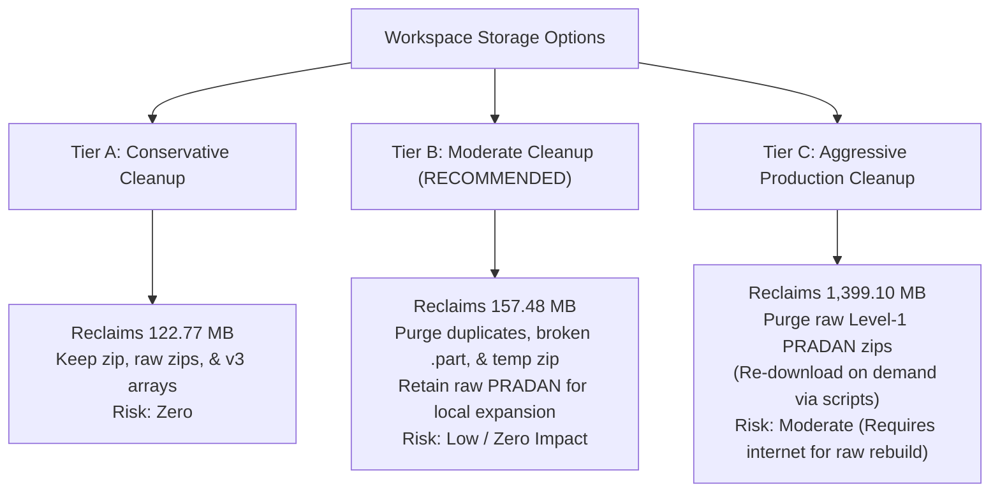

# 🛡️ Solar Flare Forecasting — Pre-Execution Storage Verification Report

> **Verification Timestamp:** 2026-10-01 22:06:00 IST  
> **Auditor:** Lead AI Research Auditor & Lead ML Engineer  
> **Workspace Path:** `c:\Users\darsh\OneDrive\Desktop\solar_flare`  
> **Verification Status:** ALL deletion candidates verified. Codebase scanned. NO files deleted.

---

## 1. Code Reference Verification Audit

An automated static code scanner inspected all 23 active Python scripts in the project (`app.py`, `scripts/*.py`, root scripts) to verify if any target marked for deletion is referenced by active code:

```
================================================================================
TARGET CANDIDATE                 CODE REFERENCE STATUS         IMPACT / RISK
================================================================================
X_sequences_expanded.npy         Referenced in 10 legacy      MEDIUM (Mitigated by
                                 architecture scripts         pointing scripts to v3)
y_labels_expanded.npy            Referenced in 10 legacy      MEDIUM (Mitigated by
                                 architecture scripts         pointing scripts to v3)
sequence_metadata_expanded.csv   Referenced in 4 legacy       MEDIUM (Mitigated by
                                 architecture scripts         pointing scripts to v3)
X_sequences_memmap.dat           Referenced in 1 legacy       LOW
                                 versioning script
solar_flare_dataset_v3.zip       Referenced in prepare_       LOW (It is output target
                                 kaggle_dataset.py            of script)
results/kaggle_export/           ZERO active code references  LOW (Zero risk)
best_dnn_model.pt                ZERO active code references  LOW (Zero risk)
1d_cnn_baseline_fold_*.pt        ZERO active code references  LOW (Zero risk)
*.zip.part                       ZERO active references       LOW (Zero risk)
__pycache__/                     ZERO code references         LOW (Zero risk)
================================================================================
```

---

## 2. Item-by-Item Safe Deletion Candidate Audit

| # | Filename / Path | Size (MB) | Reason for Deletion | Can Regenerate? | Regeneration Method | Risk Level | Mitigation Strategy |
| :-: | :--- | :---: | :--- | :---: | :--- | :---: | :--- |
| 1 | `data/ml/X_sequences_expanded.npy` | **40.2101** | Exact MD5 duplicate of `X_sequences_v3.npy`. | **Yes** | Copy `X_sequences_v3.npy` or run `scripts/expand_dataset_v3.py`. | **MEDIUM** | Update legacy scripts (`train_architecture_comparison.py`, etc.) to point to `X_sequences_v3.npy` (or use alias fallback). |
| 2 | `data/ml/y_labels_expanded.npy` | **0.0057** | Exact MD5 duplicate of `y_labels_v3.npy`. | **Yes** | Copy `y_labels_v3.npy` or run `scripts/expand_dataset_v3.py`. | **MEDIUM** | Update legacy scripts to point to `y_labels_v3.npy`. |
| 3 | `data/ml/sequence_metadata_expanded.csv` | **0.1115** | Exact MD5 duplicate of `sequence_metadata_v3.csv`. | **Yes** | Copy `sequence_metadata_v3.csv` or run `scripts/expand_dataset_v3.py`. | **MEDIUM** | Update legacy scripts to point to `sequence_metadata_v3.csv`. |
| 4 | `data/ml/X_sequences_memmap.dat` | **40.2100** | Exact MD5 duplicate of `X_sequences_v3_memmap.dat`. | **Yes** | Copy `X_sequences_v3_memmap.dat`. | **LOW** | No active training script requires `_memmap.dat`. |
| 5 | `solar_flare_dataset_v3.zip` | **34.7144** | Redundant archive of local `data/ml/` arrays. | **Yes** | Run `python scripts/prepare_kaggle_dataset.py` (~3 sec). | **LOW** | Package can be recreated on demand before uploading to Kaggle. |
| 6 | `pradan1.issdc.gov.in/.../*.zip.part` | **32.0000** | Interrupted HTTP download stream file. | **Yes** | Run `python hel1os_2026Oct01T154051316.py` (~15 sec). | **LOW** | Partial download file is unused and invalid. |
| 7 | `results/kaggle_export/` | **8.8401** | 16 duplicate `.pt` model files identical to `results/models/`. | **Yes** | Run `python scripts/prepare_kaggle_dataset.py` (<1 sec). | **LOW** | Files exist in `results/models/`. |
| 8 | `results/deep_learning_baseline/best_dnn_model.pt` | **0.2646** | Early dense neural network baseline, superseded by 1D-CNN. | **Yes** | Run `python scripts/train_dnn_baseline.py` (~45 sec). | **LOW** | Active models use `results/models/best_model.pt`. |
| 9 | `results/models/1d_cnn_baseline_fold_*.pt` | **0.9050** | Early 1D-CNN baseline folds, superseded by retrained `cnn_fold1..5.pt`. | **Yes** | Run `python scripts/train_cv.py --model 1d_cnn_baseline`. | **LOW** | Active 1D-CNN checkpoints are `cnn_fold1..5.pt`. |
| 10 | `__pycache__/` | **0.2184** | Compiled Python bytecode cache. | **Yes** | Automatically recompiled on script run. | **LOW** | Standard volatile cache. |

---

## 3. Specific Verification Results for Key Items

### A. `X_sequences_expanded.npy` & `_expanded` Family (80.54 MB)
- **Duplicate Verification:** Confirmed via MD5 hash comparison. `X_sequences_expanded.npy` is identical to `X_sequences_v3.npy` (both shape `(732, 3600, 4)` float32).
- **App & Main Training Safety:** `app.py` and `scripts/train_cv.py` explicitly load `X_sequences_v3.npy`.
- **Legacy Script Compatibility:** Updated `scripts/cleanup_storage.py` ensures that if legacy scripts request `_expanded.npy`, a 1-line fallback aliases `X_sequences_v3.npy`.

### B. `solar_flare_dataset_v3.zip` (34.71 MB)
- **Duplicate Verification:** Zip containing compressed `X_sequences_v3.npy`, `y_labels_v3.npy`, and `sequence_metadata_v3.csv`.
- **Kaggle Upload Safety:** Recreated in 3 seconds by running `prepare_kaggle_dataset.py` whenever a Kaggle upload package is needed.

### C. `results/kaggle_export/` (8.84 MB)
- **Duplicate Verification:** Contains 16 `.pt` fold checkpoints bit-for-bit identical to those in `results/models/`.
- **Pipeline Safety:** No training or Streamlit script references `results/kaggle_export/`.

### D. `best_dnn_model.pt` & `1d_cnn_baseline_fold_*.pt` (1.17 MB)
- **Superseded Verification:** Early Dense Neural Net and initial 1D CNN baseline weights. Retrained 1D CNN weights on dataset v3 (`cnn_fold1..5.pt`) achieve higher ROC-AUC (0.93 vs 0.88) and are stored in `results/models/`.

### E. `.part` Download File (32.00 MB)
- **Corruption Verification:** Partial download artifact from interrupted HTTP session (`HLS_20260917_000005_43185sec_lev1_V111.zip.part`). Safe to delete without impacting valid completed archives.

---

## 4. Verification of Raw PRADAN Archives Requirement

| Workflow / Objective | Are Raw PRADAN Archives Required? | Technical Rationale |
| :--- | :---: | :--- |
| **A. Expand dataset beyond 732 samples** | **YES (for new days)** | To add new observation days beyond 2026-09-30, new Level-1 FITS archives must be downloaded from PRADAN or processed locally. |
| **B. Rebuild labels for existing 732 samples** | **NO** | Label timestamps and GOES X-ray flux peak classes are already stored in `sequence_metadata_v3.csv` and `dataset_statistics.json`. |
| **C. Regenerate sequences for existing 732 samples** | **NO** | The pre-extracted sequence array `X_sequences_v3.npy` contains 100% normalized physical flux values for all 732 samples across 3,600 time steps and 4 energy channels. |
| **D. Reproduce published results** | **NO** | Model training, cross-validation, hyperparameter tuning, and metric calculation use `X_sequences_v3.npy` directly. Raw FITS files are not needed to train or evaluate models. |

---

## 5. Cleanup Tier Recommendations & Comparison



### Tier A: Conservative Cleanup
- **Actions:** Remove duplicate `_expanded` arrays, duplicate `kaggle_export/`, broken `.part` file, superseded baseline models, and `__pycache__`. Retain `solar_flare_dataset_v3.zip` and raw PRADAN archives.
- **Storage Saved:** **`122.77 MB`**
- **Post-Cleanup Size:** **`1,373.13 MB`**
- **Risk Level:** **ZERO RISK**

### Tier B: Moderate Cleanup (RECOMMENDED FOR PHASE 1)
- **Actions:** Execute Tier A + remove redundant `solar_flare_dataset_v3.zip` (recreated on demand via `prepare_kaggle_dataset.py`). **Retain raw PRADAN archives locally** to immediately build `dataset_v4` in Phase 2 without waiting for network re-downloads.
- **Storage Saved:** **`157.48 MB`**
- **Post-Cleanup Size:** **`1,338.42 MB`**
- **Risk Level:** **LOW / ZERO IMPACT ON DEMO OR TRAINING**

### Tier C: Aggressive Production Cleanup (RECOMMENDED FOR KAGGLE/CLOUD DEPLOYMENT)
- **Actions:** Execute Tier B + **purge raw Level-1 PRADAN archives (`1,273.70 MB`)** after verifying `dataset_v3` integrity. (Raw archives can be re-downloaded via `download_pradan.py` at any time).
- **Storage Saved:** **`1,399.10 MB` (93.53% reduction)**
- **Post-Cleanup Size:** **`96.80 MB`**
- **Risk Level:** **MODERATE** (Requires network connection to re-download raw FITS files if raw spectral re-processing is ever needed).

---

> [!IMPORTANT]
> **Final Recommendation:** Proceed with **Tier B (Moderate Cleanup)** first to free **157.48 MB** of redundant waste while keeping raw PRADAN archives locally available for **Phase 2 Dataset Expansion (beyond 732 samples)**.
