# 💾 Solar Flare Forecasting — Comprehensive Project Storage Audit

> **Audit Timestamp:** 2026-10-01 22:00:00 IST  
> **Auditor:** Lead AI Research & ML Engineering Auditor  
> **Workspace Path:** `c:\Users\darsh\OneDrive\Desktop\solar_flare`  
> **Audit Constraint:** NO files deleted. Complete empirical analysis prior to cleanup execution.

---

## 1. Storage Usage by Folder

The total project footprint is **1,495.90 MB** (~1.46 GB) across **165 non-git files** (or **1,502.15 MB** / 234 files including `.git`).

```
solar_flare/
├── pradan1.issdc.gov.in/ ......... 1,273.70 MB (27 files)  [85.15% of project]
├── data/ ........................... 161.46 MB (16 files)  [10.79% of project]
│   ├── raw/ ........................   0.00 MB (0 files)
│   ├── processed/ ..................   0.00 MB (0 files)
│   ├── ml/ ......................... 161.07 MB (8 files)
│   ├── test_samples/ ...............   0.38 MB (4 files)
│   └── metadata/ ...................   0.0009 MB (2 files)
├── solar_flare_dataset_v3.zip ......  34.71 MB (1 archive) [ 2.32% of project]
├── results/ ........................  25.47 MB (95 files)  [ 1.70% of project]
│   ├── models/ .....................   9.93 MB (40 files)
│   ├── kaggle_export/ ..............   8.84 MB (16 files)
│   ├── deep_learning_baseline/ .....   0.91 MB (6 files)
│   ├── figures/ ....................   1.30 MB (7 files)
│   └── expanded/ ...................   0.0009 MB (1 file)
├── .git/ ...........................   6.25 MB (69 files)  [ 0.42% of project]
├── scripts/ ........................   0.19 MB (17 files)  [ 0.01% of project]
├── __pycache__/ ....................   0.14 MB (2 files)   [ 0.01% of project]
└── Root Python/Doc Files ..........   0.23 MB (6 files)   [ 0.02% of project]
```

---

## 2. Master Folder Storage & Lifecycle Audit Table

| Folder Path | Size (MB) | File Count | Primary Purpose | Required for App? | Can Regenerate? | Delete / Retention Recommendation |
| :--- | :---: | :---: | :--- | :---: | :---: | :--- |
| `pradan1.issdc.gov.in/` | **1,273.70** | 27 | Level-1 raw HEL1OS/SoLEXS ZIP archives downloaded from ISRO PRADAN portal. | ❌ No | YES (via Python download scripts) | **OPTIONAL / ARCHIVE** (Contains 1 broken `.part` file; raw archives can be moved to external cold storage or deleted after `v3` dataset verification). |
| `data/ml/` | **161.07** | 8 | Preprocessed sequence matrices (`.npy`), memmaps (`.dat`), metadata CSVs for ML models. | YES | YES (from raw FITS) | **KEEP / CLEANUP DUPES** (Contains duplicate `_expanded` vs `_v3` arrays saving 80.54 MB upon deduplication). |
| `solar_flare_dataset_v3.zip` | **34.71** | 1 | Standalone Kaggle dataset upload package containing compressed `.npy` arrays & metadata. | ❌ No | YES (via `prepare_kaggle_dataset.py`) | **SAFE TO DELETE** (Redundant relative to local `data/ml/` and downloadable on demand). |
| `results/models/` | **9.93** | 40 | Trained PyTorch model checkpoints (`.pt`), history pickles (`.pkl`), best model pointers. | YES | YES (by retraining) | **KEEP** (Essential for inference, benchmark comparisons, and Streamlit demo). |
| `results/kaggle_export/` | **8.84** | 16 | Export folder containing exact copies of trained fold models for Kaggle upload. | ❌ No | YES (by re-copying) | **SAFE TO DELETE** (100% duplicate of checkpoints in `results/models/`). |
| `results/figures/` & Root PNGs | **2.61** | 18 | Diagnostic plots, ROC/PR curves, confusion matrices, data quality charts. | ❌ No | YES (via plotting scripts) | **KEEP** (High research value for reports and publication). |
| `results/deep_learning_baseline/` | **0.91** | 6 | Deprecated baseline DNN weights (`best_dnn_model.pt`) and initial evaluation metrics. | ❌ No | YES | **SAFE TO DELETE** (Superseded by 1D-CNN and Hybrid architectures). |
| `scripts/` | **0.19** | 17 | Core pipeline, feature extraction, training, evaluation, and utility scripts. | YES | ❌ No | **DO NOT DELETE** (Source code for complete project reproducibility). |
| `__pycache__/` & `.pytest_cache/` | **0.14** | 2 | Python bytecode compilation cache. | ❌ No | YES (auto-generated) | **SAFE TO DELETE** (Standard volatile cache). |
| `data/test_samples/` | **0.38** | 4 | CSV & NPY test samples for Streamlit app quick-loading. | YES | YES | **KEEP** (Required for instant demo testing). |
| `data/metadata/` | **0.0009** | 2 | JSON dataset manifests (`dataset_statistics.json`, `dataset_v2_manifest.json`). | YES | YES | **KEEP** (Lightweight tracking manifests). |
| `data/raw/` & `data/processed/` | **0.00** | 0 | Empty pipeline staging directories. | ❌ No | YES | **KEEP** (Directory structure placeholders). |

---

## 3. Storage Inefficiencies & Waste Identification

### A. Exact Duplicate Files (Total: 89.56 MB across 21 files)
1. **`data/ml/` Dataset Array Duplicates (80.54 MB)**:
   - `data/ml/X_sequences_v3.npy` (40.21 MB) ↔ `data/ml/X_sequences_expanded.npy` (40.21 MB) *(Identical MD5 Hash)*
   - `data/ml/X_sequences_v3_memmap.dat` (40.21 MB) ↔ `data/ml/X_sequences_memmap.dat` (40.21 MB) *(Identical MD5 Hash)*
   - `data/ml/y_labels_v3.npy` (0.0057 MB) ↔ `data/ml/y_labels_expanded.npy` (0.0057 MB) *(Identical MD5 Hash)*
   - `data/ml/sequence_metadata_v3.csv` (0.1115 MB) ↔ `data/ml/sequence_metadata_expanded.csv` (0.1115 MB) *(Identical MD5 Hash)*
2. **`results/kaggle_export/` Checkpoint Duplicates (8.84 MB)**:
   - All 16 `.pt` model files in `results/kaggle_export/` are bit-for-bit identical copies of corresponding fold models in `results/models/`.
3. **`results/models/` Pointer Duplicates (0.18 MB)**:
   - `results/models/cnn_fold1.pt` (0.1806 MB) ↔ `results/models/best_model.pt` (0.1806 MB) *(Identical MD5 Hash)*

### B. Temporary & Incomplete Files (Total: 66.71 MB)
1. **Incomplete Download Artifact**: `pradan1.issdc.gov.in/.../HLS_20260917_000005_43185sec_lev1_V111.zip.part` (**32.00 MB**) — Interrupted HTTP stream file.
2. **Redundant Export Archive**: `solar_flare_dataset_v3.zip` (**34.71 MB**) — Uncompressed zip of `data/ml/` files already existing locally.

### C. Abandoned / Superseded Model Experiments (Total: 1.17 MB)
1. `results/deep_learning_baseline/best_dnn_model.pt` (**0.2646 MB**) — Early dense neural network baseline.
2. `results/models/1d_cnn_baseline_fold_1..5.pt` (**0.9050 MB**) — Initial 1D CNN baseline folds, replaced by retrained `cnn_fold1..5.pt` on dataset v3.

### D. Volatile Caches
1. `__pycache__/` (**0.14 MB**) — Compiled bytecode files.

---

## 4. Verified Model Checkpoint Inventory

All 38 checkpoint files detected across the codebase have been inspected for integrity, size, architecture mapping, and modification timestamps:

| Checkpoint Path | Architecture | Fold | Size (MB) | Last Modified Timestamp | Status / Use Case |
| :--- | :--- | :---: | :---: | :---: | :--- |
| `results/models/best_model.pt` | 1D CNN (Optimal Weights) | Fold 1 | **0.1806** | 2026-10-01 21:05:34 | **ACTIVE / STREAMLIT DEMO** |
| `results/models/cnn_fold1.pt` | 1D CNN (v3 Retrained) | Fold 1 | **0.1806** | 2026-10-01 20:59:03 | **ACTIVE CHECKPOINT** |
| `results/models/cnn_fold2.pt` | 1D CNN (v3 Retrained) | Fold 2 | **0.1806** | 2026-10-01 21:01:06 | **ACTIVE CHECKPOINT** |
| `results/models/cnn_fold3.pt` | 1D CNN (v3 Retrained) | Fold 3 | **0.1806** | 2026-10-01 21:03:11 | **ACTIVE CHECKPOINT** |
| `results/models/cnn_fold4.pt` | 1D CNN (v3 Retrained) | Fold 4 | **0.1806** | 2026-10-01 21:03:56 | **ACTIVE CHECKPOINT** |
| `results/models/cnn_fold5.pt` | 1D CNN (v3 Retrained) | Fold 5 | **0.1806** | 2026-10-01 21:05:06 | **ACTIVE CHECKPOINT** |
| `results/models/cnn_+_bilstm_hybrid_fold_1.pt` | CNN + BiLSTM | Fold 1 | **0.7204** | 2026-09-04 20:07:04 | **ACTIVE CHECKPOINT** |
| `results/models/cnn_+_bilstm_hybrid_fold_2.pt` | CNN + BiLSTM | Fold 2 | **0.7204** | 2026-09-04 20:12:05 | **ACTIVE CHECKPOINT** |
| `results/models/cnn_+_bilstm_hybrid_fold_3.pt` | CNN + BiLSTM | Fold 3 | **0.7204** | 2026-09-04 20:18:29 | **ACTIVE CHECKPOINT** |
| `results/models/cnn_+_bilstm_hybrid_fold_4.pt` | CNN + BiLSTM | Fold 4 | **0.7204** | 2026-09-04 20:33:04 | **ACTIVE CHECKPOINT** |
| `results/models/cnn_+_bilstm_hybrid_fold_5.pt` | CNN + BiLSTM | Fold 5 | **0.7204** | 2026-09-04 20:36:58 | **ACTIVE CHECKPOINT** |
| `results/models/cnn_+_attention_+_bilstm_fold_1.pt` | CNN + Attention + BiLSTM | Fold 1 | **0.7537** | 2026-09-04 20:40:00 | **ACTIVE CHECKPOINT** |
| `results/models/cnn_+_attention_+_bilstm_fold_2.pt` | CNN + Attention + BiLSTM | Fold 2 | **0.7537** | 2026-09-04 20:47:40 | **ACTIVE CHECKPOINT** |
| `results/models/cnn_+_attention_+_bilstm_fold_3.pt` | CNN + Attention + BiLSTM | Fold 3 | **0.7537** | 2026-09-04 20:54:12 | **ACTIVE CHECKPOINT** |
| `results/models/cnn_+_attention_+_bilstm_fold_4.pt` | CNN + Attention + BiLSTM | Fold 4 | **0.7537** | 2026-09-04 21:30:49 | **ACTIVE CHECKPOINT** |
| `results/models/cnn_+_attention_+_bilstm_fold_5.pt` | CNN + Attention + BiLSTM | Fold 5 | **0.7537** | 2026-09-04 21:36:03 | **ACTIVE CHECKPOINT** |
| `results/models/temporal_convolutional_network_(tcn)_fold_1.pt` | TCN | Fold 1 | **0.5647** | 2026-09-04 22:14:28 | **ACTIVE CHECKPOINT** |
| `results/models/1d_cnn_baseline_fold_1..5.pt` (5 files) | 1D CNN Baseline (Early) | Folds 1–5 | **0.9050** | 2026-09-04 19:44:10 | SUPERSEDED BY `cnn_fold*` |
| `results/kaggle_export/*.pt` (16 files) | Multi-architecture Export | Folds 1–5 | **8.8401** | 2026-10-01 20:46:24 | DUPLICATE EXPORT COPY |
| `results/deep_learning_baseline/best_dnn_model.pt` | Dense Neural Net | Full | **0.2646** | 2026-09-04 09:23:55 | DEPRECATED BASELINE |

---

## 5. Minimum File Sets Required by Operational Scenario

### Scenario A: Full Offline Retraining Pipeline (1,435.5 MB)
*To re-extract features from raw solar physics data and train all models from scratch:*
- Python Code: `scripts/*.py`, `requirements.txt`
- Raw Data: `pradan1.issdc.gov.in/` (26 verified Level-1 `.zip` archives, ~1,241.7 MB)
- Processed Outputs: `data/ml/` directory structure

### Scenario B: Kaggle Cloud Training & Competition Upload (35.2 MB)
*To package and upload the lightweight ML dataset to Kaggle for GPU accelerated training:*
- Upload Package: `solar_flare_dataset_v3.zip` (34.71 MB) **OR** `data/ml/X_sequences_v3.npy` + `y_labels_v3.npy` + `sequence_metadata_v3.csv`
- Kaggle Metadata: `data/KAGGLE_README.md`, `data/dataset-metadata.json`
- Kaggle Script: `scripts/prepare_kaggle_dataset.py`

### Scenario C: Headless Batch Inference & Model Evaluation (41.5 MB)
*To run prediction scripts or benchmark evaluation on pre-extracted solar arrays:*
- Python Code: `scripts/evaluate_models.py`, `scripts/train_cv.py`, `requirements.txt`
- ML Arrays: `data/ml/X_sequences_v3.npy` (40.21 MB), `y_labels_v3.npy` (0.0057 MB)
- Checkpoints: `results/models/best_model.pt` (0.18 MB) or active fold weights
- Threshold Data: `results/models/best_threshold.pkl` (or `results/threshold_metrics.csv`)

### Scenario D: Lightweight Streamlit Web Application (1.2 MB)
*To run `streamlit run app.py` for user demo and real-time visualization:*
- Web Application Code: `app.py`
- Configuration & Dependencies: `requirements.txt`
- Model Weights: `results/models/best_model.pt` (0.18 MB)
- Threshold File: `results/models/best_threshold.pkl` (0.001 MB)
- Sample Datasets for Demo: `data/test_samples/` (0.38 MB containing 2 CSVs and 2 NPY event files)
- Metric Benchmarks: `results/threshold_metrics.csv` (0.0038 MB)

> [!TIP]
> The Streamlit application requires **less than 1.5 MB** of storage to run in standalone demo mode when utilizing `data/test_samples/`.

---

## 6. Actionable File Classification Recommendations

```mermaid
flowchart TD
    A["Solar Flare Project Workspace (1,495.90 MB)"] --> B["DO NOT DELETE (Code & Active ML)"]
    A --> C["KEEP (Evaluation & Figures)"]
    A --> D["OPTIONAL / COLD STORAGE (Raw PRADAN Archives)"]
    A --> E["SAFE TO DELETE (Duplicates & Temp Cache)"]

    B --> B1["scripts/, app.py, requirements.txt (0.22 MB)"]
    B --> B2["data/ml/v3 arrays (40.33 MB)"]
    B --> B3["results/models/ active weights (7.25 MB)"]

    C --> C1["results/figures/ & diagnostic plots (2.61 MB)"]
    C --> C2["data/test_samples/ (0.38 MB)"]
    C --> C3["Benchmark CSVs & metadata (0.15 MB)"]

    D --> D1["pradan1.issdc.gov.in/ valid ZIPs (1,241.70 MB)"]

    E --> E1["Duplicate _expanded arrays in data/ml/ (80.54 MB)"]
    E --> E2["Incomplete download .part file (32.00 MB)"]
    E --> E3["Redundant solar_flare_dataset_v3.zip (34.71 MB)"]
    E --> E4["Duplicate results/kaggle_export/ models (8.84 MB)"]
    E --> E5["Deprecated baseline DNN & CNN weights (1.17 MB)"]
    E --> E6["__pycache__ bytecode (0.14 MB)"]
```



### 🔴 DO NOT DELETE (Essential Core Assets — 47.80 MB)
- `app.py`, `requirements.txt`, `README.md`, `final_project_report.md`
- `scripts/` (All 17 Python pipeline scripts)
- `data/ml/X_sequences_v3.npy`, `y_labels_v3.npy`, `sequence_metadata_v3.csv`, `X_sequences_v3_memmap.dat`
- `results/models/best_model.pt`, `best_threshold.pkl`
- `results/models/cnn_fold1..5.pt`, `cnn_+_bilstm_hybrid_fold_1..5.pt`, `cnn_+_attention_+_bilstm_fold_1..5.pt`, `temporal_convolutional_network_(tcn)_fold_1.pt`

### 🟡 KEEP (High-Value Research Assets — 3.14 MB)
- `data/test_samples/*` (4 sample files for demo app)
- `results/figures/*` & all diagnostic `.png` plots in `results/`
- `results/threshold_metrics.csv`, `results/experiment_registry.csv`, `results/raw_data_manifest.csv`
- `data/metadata/dataset_statistics.json`, `dataset_v2_manifest.json`

### 🟠 OPTIONAL / ARCHIVE (Cold Data — 1,241.70 MB)
- `pradan1.issdc.gov.in/.../*.zip` (26 completed Level-1 raw archives).  
  *Recommendation:* Keep on local disk if disk space is non-critical, or move to secondary drive. Can be deleted if disk space is needed since `X_sequences_v3.npy` is already built and `scripts/download_pradan.py` can re-fetch them automatically.

### 🟢 SAFE TO DELETE (Immediate Cleanup Targets — 157.40 MB)
1. **`data/ml/X_sequences_expanded.npy`** (40.21 MB) — Duplicate of `v3`
2. **`data/ml/X_sequences_memmap.dat`** (40.21 MB) — Duplicate of `v3`
3. **`data/ml/y_labels_expanded.npy`** (0.0057 MB) — Duplicate of `v3`
4. **`data/ml/sequence_metadata_expanded.csv`** (0.1115 MB) — Duplicate of `v3`
5. **`solar_flare_dataset_v3.zip`** (34.71 MB) — Redundant root zip
6. **`pradan1.issdc.gov.in/.../HLS_20260917_000005_43185sec_lev1_V111.zip.part`** (32.00 MB) — Corrupted/partial download
7. **`results/kaggle_export/`** (8.84 MB) — 16 duplicate `.pt` files
8. **`results/deep_learning_baseline/best_dnn_model.pt`** (0.26 MB) — Deprecated model
9. **`results/models/1d_cnn_baseline_fold_1..5.pt`** (0.91 MB) — Superseded model folds
10. **`__pycache__/`** (0.14 MB) — Compiled cache files

---

## 7. Storage Optimization & Cleanup Estimate

### Storage Reduction Scenarios

| Scenario | Strategy Description | Storage Before | Storage After | Storage Saved | % Savings |
| :--- | :--- | :---: | :---: | :---: | :---: |
| **Strategy A: Conservative Cleanup** | Remove duplicates, broken `.part` downloads, redundant `.zip`, export folders, and superseded models while **retaining raw PRADAN archives** for offline training. | **1,495.90 MB** | **1,338.50 MB** | **157.40 MB** | **10.52%** |
| **Strategy B: Aggressive Production Cleanup** | Perform Strategy A + **purge raw Level-1 PRADAN archives** (relying on `v3` pre-extracted arrays and automated download scripts for future rebuilds). | **1,495.90 MB** | **96.80 MB** | **1,399.10 MB** | **93.53%** |
| **Strategy C: Lightweight Deployment (Demo Only)** | Retain only `app.py`, `scripts/`, `best_model.pt`, `data/test_samples/`, and core documentation. | **1,495.90 MB** | **8.15 MB** | **1,487.75 MB** | **99.46%** |

---

> [!IMPORTANT]
> **Audit Status:** NO files have been modified or deleted during this audit step. All 165 files remain intact in their original locations.
